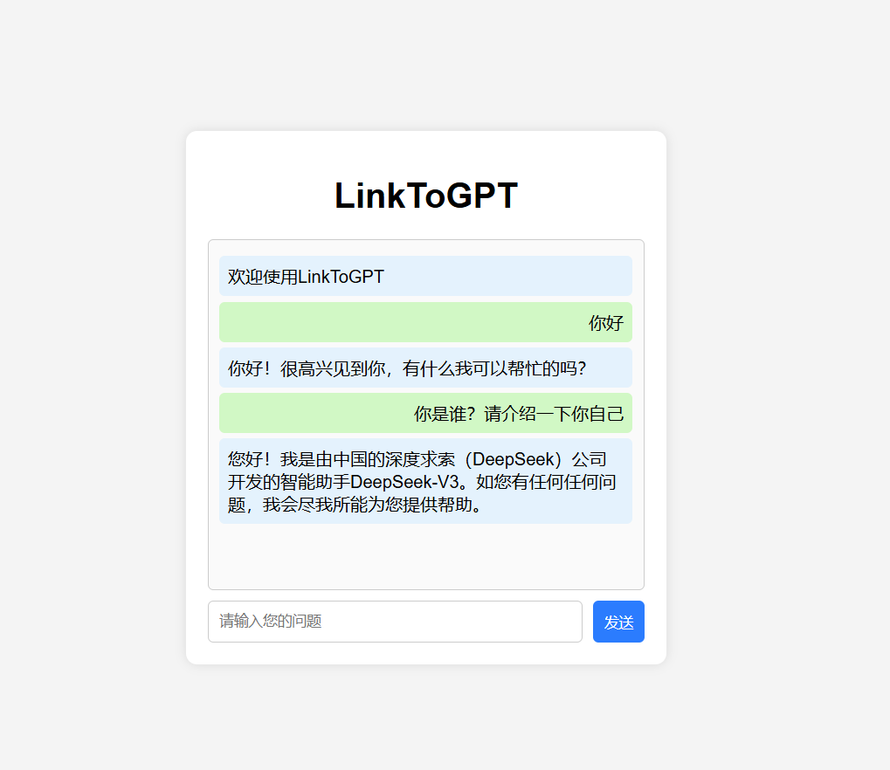

LinkToGPT项目用于学习前后端代码交互和在线大模型的API调用

使用方法：
1. 参考InstalledPackage.txt文件安装对应第三方库
2. 在本地配置自己的.env文件，具体内容为
```
OPENAI_API_KEY='<你的APIkey>'
BASEURL='<大模型访问链接>'
```
3. 运行本地服务器，端口号：3000。有两个服务器建立文件可供选择：
```
以下两个运行一个就行
node server.js
python server.py
```
4. 打开index.html网页，聊吧